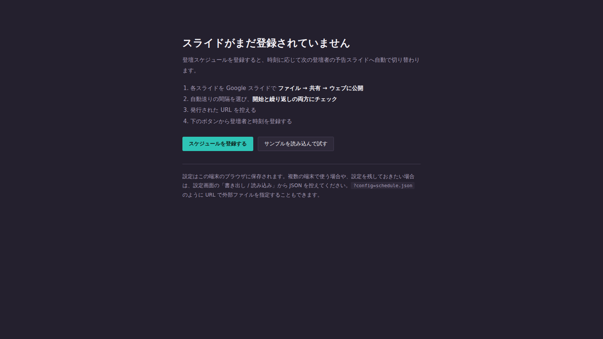
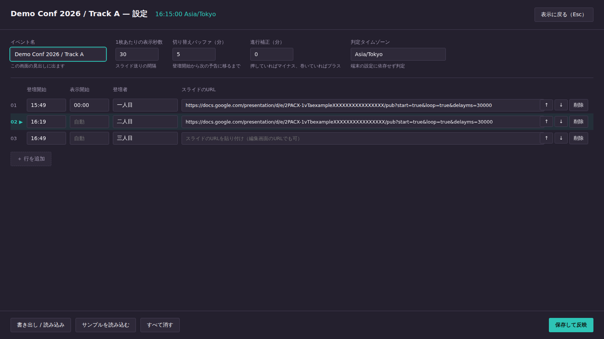
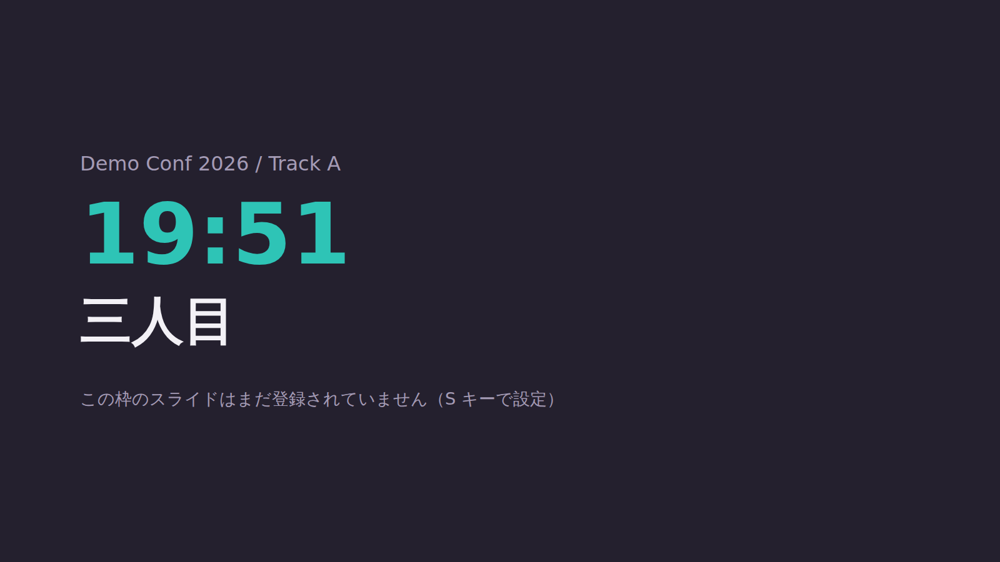

<h1 align="center">makuai-slide-scheduler</h1>

<p align="center">
  カンファレンスの幕間に「次の登壇者」の予告スライドを映すサイネージ。<br>
  登壇スケジュールを登録しておくと、時刻に応じて表示するスライドが自動で切り替わります。
</p>

<p align="center">
  
  
  
  <a href="LICENSE"></a>
</p>


> スクリーンショットは架空のイベントによるデモです。画面に映っているスライドはデモ用のページで、実際には Google スライドが埋め込まれます。

## 特長

- **HTML 1枚** — サーバーもビルドも npm も不要。`index.html` を開くだけ
- **時刻で自動切り替え** — 登壇が始まったら、次の登壇者の予告へ
- **タイムゾーン固定の判定** — 端末のタイムゾーン設定に依存しない
- **進行のズレを吸収** — 押し / 巻きを矢印キーで 5 分ずつ補正
- **スライド未設定でも止まらない** — 空の枠は登壇者カードで埋める
- **キオスク前提** — `./signage.sh` を叩けば Raspberry Pi でサイネージモードに入る

## クイックスタート

### 1. スライドを公開する

各スライドを Google スライドで開き、**ファイル → 共有 → ウェブに公開**。

- 「自動的にスライドを進める」で間隔を選ぶ
- 「プレーヤーの読み込み後に自動的に開始する」にチェック
- 「最後のスライドの後に自動的に最初から開始する」にチェック

発行された URL を控えます。編集画面の URL（`.../edit?usp=sharing`）をそのまま貼っても、自動で埋め込み用に変換されます。

### 2. 開く

`index.html` をブラウザで開きます。まだ何も登録されていなければセットアップ画面が出ます。



### 3. スケジュールを登録する

`S` キーか「スケジュールを登録する」から設定画面へ。登壇開始の時刻、登壇者名、スライドの URL を並べます。現在表示中の行には `▶` が付きます。



### 4. サイネージモードで起動する

```sh
./signage.sh
```

Chromium をキオスク表示で開きます。Wayland / X11 の判定、SSH から起動したときの環境変数（`WAYLAND_DISPLAY` や `DISPLAY`）の補完、前回の異常終了で出る「復元しますか」バーの抑止は、スクリプト側で済ませます。

| コマンド | 用途 |
|---|---|
| `./signage.sh` | キオスク表示（本番） |
| `./signage.sh --windowed` | ウィンドウ表示（本番前の確認用） |
| `./signage.sh -- <引数...>` | 以降を Chromium にそのまま渡す |

設定は Chromium のプロファイルに保存されます。普段のブラウジング用と混ざらないよう `~/.config/makuai-slide-scheduler/chromium` を使うので、**スケジュールの登録もこのスクリプトで開いた画面から行ってください**（表示中に `S` キー）。置き場所は `MAKUAI_PROFILE` で変えられます。

Wayland では画面の自動消灯をアプリ側から止められないため、先に切っておきます。

```sh
sudo raspi-config   # Display Options -> Screen Blanking -> No
```

スクリプトを使わない場合は、次のコマンドとほぼ同じことをしています。

```sh
chromium --kiosk --ozone-platform=wayland --password-store=basic \
  --disable-session-crashed-bubble --disable-infobars --noerrdialogs \
  --user-data-dir="$HOME/.config/makuai-slide-scheduler/chromium" \
  "file:///path/to/index.html"
```

## 切り替えの考え方

「登壇が始まったら、次の登壇者の予告に切り替える」という運用を想定しています。

登壇開始のちょうどに切り替えると、開始が押したときに予告が消えてしまいます。そこで **切り替えバッファ**（既定 5 分）を設け、登壇開始から少し経ってから次の予告に移ります。

| 時刻 | 表示 |
|---|---|
| 開場〜13:04 | 一人目の予告 |
| 13:05〜13:34 | 二人目の予告（一人目が登壇中） |
| 13:35〜 | 三人目の予告（二人目が登壇中） |

各行の「表示開始」は空のままにしておけば `前の登壇開始 + バッファ` で自動計算されます。個別に上書きしたい行だけ時刻を入れてください。

判定は設定した**タイムゾーンで行うため、端末のタイムゾーン設定に依存しません**。ただし端末の時計自体は合っている必要があります。Raspberry Pi は RTC を持たないので、NTP 同期を確認してください。

```sh
timedatectl   # System clock synchronized: yes
```

時刻の打ち間違いは、本番中に「なぜか予定と違う枠が映る」という形で現れて原因を追いにくいので、保存時に弾きます。`hh:mm` として読めない時刻、`25:00` のような存在しない時刻、認識できないタイムゾーン名があると、その入力欄に印が付いて保存されません。登壇開始が空のまま次の行を「自動」にした場合も、表示開始を決められないので同じく指摘します。

タイムゾーン名が誤っていても端末の設定には落ちません。既定の `Asia/Tokyo` で判定を続け、`H` キーの表示で警告します。

## キー操作

表示中に使えます。`H` を押すと、現在の状態と操作の一覧が数秒だけ出ます。


| キー | 動作 |
|---|---|
| `1`〜`9` | そのスライドに固定 |
| `0` | 自動スケジュールに戻す |
| `←` `→` | 進行を 5 分ずらす（押し / 巻きの吸収） |
| `S` | 設定画面 |
| `R` | 再読み込み |
| `H` | 状態と操作の一覧を表示 |

行は 10 件以上登録できますが、数字キーで直接指定できるのは 9 件目までです。

埋め込んだ Google スライドにフォーカスが移ると、キーが Google 側のショートカット（`S` でスピーカーノート等）として処理され、こちらの操作が効かなくなります。これを防ぐため、表示中はスライドをクリックできないようにし、フォーカスを常に手元へ戻しています。

進行が押すのは日常茶飯事なので、本番前にキーボードが効くことを必ず確認してください。

## スライド未設定の枠

URL が空の枠に切り替わると、黒画面ではなく登壇者名と時刻だけのカードを表示します。スライドの準備が間に合わなかった枠があっても、スケジュールの流れは止まりません。



あくまで穴埋めなので、画面には未設定である旨が小さく出ます。本番前に埋めておくのが前提です。

## 設定の保存先

設定はブラウザの localStorage に保存されます。`signage.sh` が使う Chromium では `file://` でも保存できますが、ブラウザによっては保存できないことがあります。その場合は保存時に警告が出るので、設定画面の「書き出し / 読み込み」から JSON を控えてください。

プロファイルごと消すと登録もやり直しになるので、イベントをまたいで使う設定は JSON で控えておくのが安全です。

確実に保存したい場合や、設定ファイルをリポジトリで管理したい場合は、HTTP で配信します。

```sh
cd /path/to/makuai-slide-scheduler
python3 -m http.server 8080
```

```
http://localhost:8080/?config=schedule.json
```

`?config=` で外部の JSON を読み込めます（CORS の制約により `file://` では動きません）。`schedule.example.json` を雛形にしてください。

**進行補正（`←` `→`）だけは端末ごとに別で保存されます。** スケジュールは全端末で共有したい一方、押し / 巻きの吸収はその端末で今起きていることなので、`?config=` で共有の JSON を読む運用でもブラウザを再起動すれば補正が戻る、という事態を避けています。補正を 0 に戻すには設定画面の「進行補正」を 0 にして保存してください。

イベントごとの `schedule.json` は各自の登壇者情報を含むので、リポジトリで共有する場合は `.gitignore` に入れることをおすすめします。

## 制約

- Google スライドの「ウェブに公開」が必要です。限定共有のままでは自動送りが効かないことがあります
- 自動送りの間隔はスライド側の公開設定と URL のパラメータの両方で指定されます。設定画面の「表示秒数」は URL 側を上書きします
- iframe で埋め込むため、Google 側の仕様変更の影響を受けます

## ライセンス

MIT
